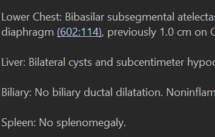
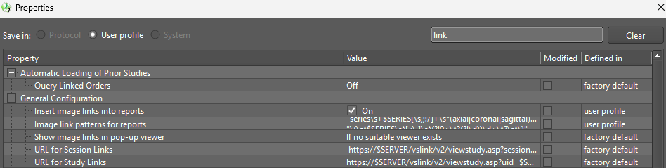

# Visage PACS image linking

## Functionality

Enables hyperlinked images to automatically display prior exam references from Visage repots. For example, here:



## How to install

To enable links, the user navigates in Visage to File → Preferences → Properties, then searches for Link. They then enable "Insert image links into reports" by checking "On", then pasting the regex pattern contained here: `regex-pattern.txt` (the link to that text file is right above these instructions!) into the "Image link patterns for reports". After restarting Visage, the links will appear in prior reports. 



In the regular expressions (regex) patterns below, `$SERIES` represents a placeholder for the matched series number (typically `\d+`).


---
## Regex Pattern Documentation
**Text below is for documentation purposes and is NOT needed for normal users.** No need to keep reading unless you want to figure out how it does what it does, or you want to contribute to improvements. 

### Pattern 1

```
images?\s+\d+\*?(\s*,\s*\d+\*?)*(\s*(,)?\s*and\s+\d+\*?)?\s*(of|in|,|/|\\)*\s*series\s+$SERIES
```

**Format:** `image(s) [number list] [of/in] series N`

Captures natural-language references where image number(s) are listed **before** the series number. Handles:

- Singular or plural "image"/"images"
- A single image number, optionally asterisked — e.g., `image 47*`
- A comma-separated list of additional images — e.g., `images 12, 47, 88`
- An optional Oxford-comma terminal "and" item — e.g., `images 12, 47, and 88`
- Optional connective words between the image list and "series": `of`, `in`, a comma, `/`, or `\`

**Example matches:** `image 47 of series 3`, `images 12, 47, and 88 series 6`

---

### Pattern 2

```
images?\s+\d+\*?(\s*through\s*|\s+and\s+|\s*-\s*)\d+\*?\s*((of|in|,|/|\\)\s*)*series\s+$SERIES
```

**Format:** `image(s) N through/and/- M [of/in] series S`

Like Pattern 1, but specifically captures **ranges** of images rather than comma-separated lists. Range connectors supported:

- `through` — e.g., `images 12 through 88`
- `and` — e.g., `images 12 and 88`
- `-` — e.g., `images 12-88`

**Example matches:** `images 12 through 88 of series 3`, `images 12-88 series 3`

---

### Pattern 3

```
series\s+$SERIES[\s,;:/]+\s*(axial|coronal|sagittal)?\s*image[s]?\s+\d+\*?(\s*,\s*\d+\*?)*(\s*(,)?\s*and\s+\d+\*?)?
```

**Format:** `series N [delimiter] [plane] image(s) [number list]`

The reverse of Pattern 1 — series number comes **first**, followed by image numbers. Additional features:

- Allows any mix of spaces, commas, semicolons, colons, or slashes as delimiters between the series and image portions
- Optionally accepts an anatomical plane qualifier — `axial`, `coronal`, or `sagittal` — before "image"
- Same flexible comma-plus-"and" list structure for image numbers

**Example matches:** `series 3: axial images 12, 47`, `series 3; images 12, 47, and 88`

---

### Pattern 4

```
\(\s*$SERIES\s*[,;\.]\s*(?!0+\*?(?!\d))\d+\*?\s*\)
```

**Format:** `series comma/semicolon/period image`, enclosed in parentheses

Captures compact parenthesized annotations where a single series and image number are paired with a non-colon delimiter.

**Exclusion:** Rejects image numbers that are zero or pure-zero strings via a negative lookahead — `0`, `00`, etc. are excluded unless followed by additional nonzero digits, so `10` or `100` are accepted while bare `0` or `00` are not.

**Example matches:** `(3, 47)`, `(3; 47)`, `(3.47)` **Excluded:** `(3, 0)`, `(3, 00*)`

---

### Pattern 5

```
\(?\s*(?<!\d)(?<!date-lookbehinds...)(?<!:)(?<!:\d)$SERIES\s*:\s*(?!0+\*?(?!\d))\d+\*?(\s*,\s*(?!\d+\s*:)(?!0+\*?(?!\d))\d+\*?)*(\s*(,)?\s*and\s+(?!\d+\s*:)(?!0+\*?(?!\d))\d+\*?)?\s*\)?(?!\d*\s*(on\s*)?\d+/\d+/\d+)(?!\d*\s*(?:AM|PM|am|pm|:|\.\d)\b)
```

**Format:** `series colon image [, image...]`, optionally enclosed in parentheses

This is the most complex pattern. It captures the primary **`series:image`** colon-notation format widely used at MGH and BWH, including comma-separated or "and"-terminated image lists.

**Prefix lookbehinds — what is excluded to avoid false positives:**

The long block of `(?<!...)` assertions prevents matching when the series number is actually part of a date or time context:

| Lookbehind                              | What it blocks                                                                                                     |
| --------------------------------------- | ------------------------------------------------------------------------------------------------------------------ |
| `(?<!\d)`                               | A digit immediately preceding the series number — avoids matching mid-number                                       |
| M/D/YYYY and MM/DD/YYYY variants        | All four combinations of 1- or 2-digit month and day preceding the series number                                   |
| Same date formats followed by `at`      | Timestamps written as e.g. `1/5/2024 at 3:00`                                                                      |
| `YYYY-Mon-D` and `YYYY-Mon-DD` variants | ISO-style dates with three-letter month abbreviations, with and without a trailing `at`                            |
| `YYYY-MM-DD` variants                   | Fully numeric ISO dates, with and without a trailing `at`                                                          |
| `(?<!:)` and `(?<!:\d)`                 | Prevents matching when the series number already follows a colon — avoids re-matching annotations already captured |

**Image number exclusions within the list:**

- Zero-only image numbers are rejected — same logic as Pattern 4
- A number followed   immediately by a colon is rejected as a candidate image number, since   that pattern indicates it is itself a series number in a compound   annotation

**Suffix lookaheads — trailing context exclusions:**

- A trailing date in M/D/YYYY format is rejected — e.g., `seen on 1/5/2024`
- Trailing time indicators are rejected — `AM`, `PM`, a colon, or a decimal digit — preventing clock times from being parsed as image numbers

**Example matches:** `3:47`, `3:12, 47, and 88`, parenthesized `(3:47)` **Excluded:** `1/5/2024 3:47`, `2024-Jan-5 3:47`, `3:00 AM`, series numbers already preceded by a colon

---

### Pattern 6

```
\(?\s*(?<!\d)(?<!date-lookbehinds...)(?<!:)(?<!:\d)$SERIES\s*:\s*(?!0+\*?(?!\d))\d+\*?(\s*through\s*|\s+and\s+|\s*-\s*)(?!0+\*?(?!\d))\d+\*?\s*\)?(?!\d*\s*(?:AM|PM|am|pm|:|\.\d)\b)
```

**Format:** `series colon image through/and/- image`, optionally enclosed in parentheses

Identical to Pattern 5 in its lookbehind and lookahead exclusion machinery, but handles **image ranges** rather than comma lists — mirroring the relationship between Patterns 1 and 2. Accepts `through`, `and`, or `-` as the range connector. The same full set of date and time exclusions from Pattern 5 applies here as well.

**Example matches:** `3:12 through 88`, parenthesized `(3:12-88)`, `3:12 and 88` **Excluded:** Same date and time contexts as Pattern 5
